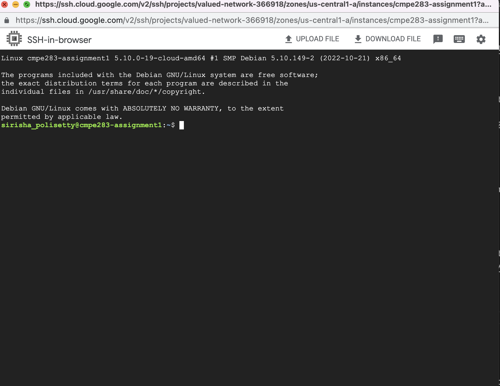

# CMPE283 : Virtualization 
# Assignment 1: Discovering VMX Features

#### 1. For each member in your team, provide 1 paragraph detailing what parts of the lab that member  implemented / researched. (You may skip this question if you are doing the lab by yourself).
- *Sirisha Polisetty(016012477)*
  - Created VM on google cloud engine.
- *Jayanth Vishal Reddy Godi (016720080)*
  - Enabled SSH Authentication on VM launched on google cloud.
  - 
#### 2. Describe in detail the steps you used to complete the assignment. Consider your reader to be someone  skilled in software development but otherwise unfamiliar with the assignment. Good answers to this  question will be recipes that someone can follow to reproduce your development steps. Note: I may decide to follow these instructions for random assignments, so you should make sure  they are accurate.

1. Created a VM on gcloud using the insturctions that are required for creating a virtualization machine with virtualization capabilities enabled.
    - use cloud shell commmand to get the details about the account from google compute engine
    - add additional details to the cloud shell command to launch instance using instructions provided.
    - generate ssh key on your local machine if it not exits
      ```
      ssh-keygen -t ed25519
      ```
    - Final cloud shell command with all the vm capabilitis with your ssh keys in metadata.
        ```
        gcloud compute instances create cmpe283-assignment1 --project=valued-network-366918 --zone=us-central1-a --machine-type=n2-standard-8 --network-interface=network-tier=PREMIUM,subnet=default --metadata=ssh-keys=jayanthvishalreddy:ssh-ed25519\ AAAAC3NzaC1lZDI1NTE5AAAAIHsTFWuRw6DNxrrQgBiIx9TSgrOtdVNEoO1aWPfbHnfs\ jayanthvishalreddy@Jayanths-MacBook-Air-2.local$'\n'siri:ssh-ed25519\ AAAAC3NzaC1lZDI1NTE5AAAAICMdhjaZM4SHxu6BC7LYeX6r6yL48fbF5D\+MFwMU4w5j\ sirishacyd@gmail.com --maintenance-policy=MIGRATE --provisioning-model=STANDARD --service-account=1044074668714-compute@developer.gserviceaccount.com --scopes=https://www.googleapis.com/auth/devstorage.read_only,https://www.googleapis.com/auth/logging.write,https://www.googleapis.com/auth/monitoring.write,https://www.googleapis.com/auth/servicecontrol,https://www.googleapis.com/auth/service.management.readonly,https://www.googleapis.com/auth/trace.append --create-disk=auto-delete=yes,boot=yes,device-name=cmpe283-assignment1,image=projects/ubuntu-os-cloud/global/images/ubuntu-2204-jammy-v20221018,mode=rw,size=200,type=projects/valued-network-366918/zones/us-central1-a/diskTypes/pd-balanced --no-shielded-secure-boot --shielded-vtpm --shielded-integrity-monitoring --reservation-affinity=any --min-cpu-platform "Intel Cascade Lake" --enable-nested-virtualization
        ```
        
2. Launched Instance with the SSH Keys Metadata added.


3. We can Login to the launched instance using two methods
    - ssh connect from the google compute engine [instances](https://console.cloud.google.com/compute/instances?authuser=1&project=valued-network-366918) page. Connected instance through SSH, launched on a web browser.
    
    - ssh connect to the instance where the private key exist for the public key that has been added for your users.
    
    

4. Installed required dependencies to perform the assignment that loads a new module into kernel.
```
sudo apt-get update
sudo apt-get upgrade
sudo apt-get install vim gcc make linux-headers-$(uname -r)
```

5. From Intel SDM Module. Get the Description for the MSR with Address from the Following Pages as per assignment requirements.
  -  IA32_VMX_PINBASED_CTLS 0x481 : Intel SDM volume 3, section 24.6.1 Table 24.5 Page 3746
  -  IA32_VMX_PROCBASED_CTLS 0x482 : Intel SDM volume 3, section 24.6.2 Table 24.6 Page 3746,3747
  -  IA32_VMX_PROCBASED_CTLS2 0x48B : Intel SDM volume 3, section 24.6.2 Table 24.7 Page 3748
  -  IA32_VMX_EXIT_CTLS 0x483 : Intel SDM volume 3, section 24.6.2 Table 24.13 Page 3756
  -  IA32_VMX_ENTRY_CTLS 0x484 : Intel SDM volume 3, section 24.6.2 Table 24.15 Page 3758
  -  IA32_VMX_PROCBASED_CTLS3 0x492 : Intel SDM volume 3, section 24.6.2 Table 24.8 Page 3749
6. Once the Sturct Definition is Done, scp the required code files in to the noed.
   - created a new folder for [cmpe283-1](cmpe283-1) module that gets loaded in to the kernel and scped the files to node.
   - scp file [cmpe283-1.c](cmpe283-1/cmpe283-1.c) to the created virtual machine.
   - > scp cmpe283-1.c   siri@34.135.130.126:/home/siri/cmpe283-1
   - scp file [MakeFile](cmpe283-1/Makefile) to the created virtual machine.
   - > scp Makefile   siri@34.135.130.126:/home/siri/cmpe283-1